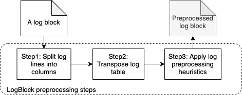

## Design

LogBlock first splits log compoents into different columns, so the log data is regarded as a matrix.
Then, the matrix is transposed to gather similar tokens which can be easily referable by the sliding window encoder (see the [shortcomings of sliding window](https://cs.stanford.edu/people/eroberts/courses/soco/projects/data-compression/lossless/lz77/shortcoming.htm)). 
Finally, each type of repetitiveness in log data will be further reduced by its corresponding heuristic. The overall workflow is shown in the following figure.

 